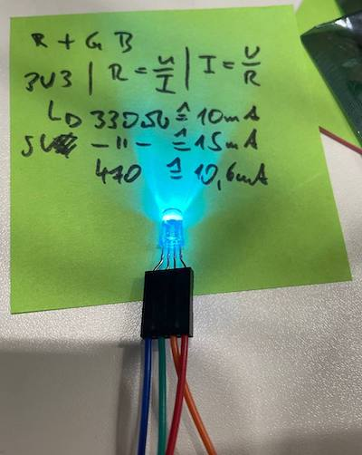

# Multi (Color) LED

Status LED for a hardware project build with a LED which is three color compatible. 

MultiLED C class for Arduino to have a simple handling.



## Hardware

A LED with a Red, Blue, Yellow and the same anode inside. Sorry 🙈 couldn't find the link where I ordered it.

### Wireing


 
Because of this wireing if you set the pin on the microcontroller to `LOW` the Led will shine and on `HIGH`be dark.

## How To

**Requirements:** Flash a MicroController e.g. ESP32 with Arduino project. 

* Connect the LED red to pin#32
* Connect the LED green to pin#33
* Connect the LED blue to pin#25
* Connect the LED annode to 3V3 (or 5V)
* Open this ino with Arduino
* Build and Flash

### Examples

```cpp
#include "MultiLed.h"
MultiLed multiLed(32, 33, 25);

void setup() {
  multiLed.setup();
}

void loop() {
  multiLed.setColor(MultiLed::COLOR_GREEN);
  delay(500);                      
}
```