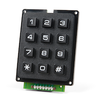

# QWIIC Keypad



### Hardware

#### Materials

* Raspberry PI Zero 2 W
* [QWIIC Shim](https://www.sparkfun.com/products/15794)
* [QWIIC Keypad](https://www.sparkfun.com/products/15290)

#### How To
* Checkout [Hookup Guide](https://learn.sparkfun.com/tutorials/qwiic-shim-for-raspberry-pi-hookup-guide#hardware-overview)
* ... and enable I2C
* If you want test your setup: Check out the section "Scanning for I2C Devices" and you should find the keypad at 0x4B

### Software

```bash
sudo node app.js
```

- I think there is something not correct with the timing, that's why there are errors.
